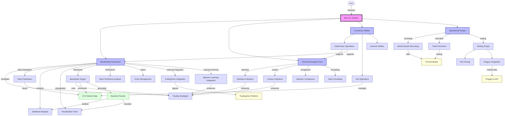
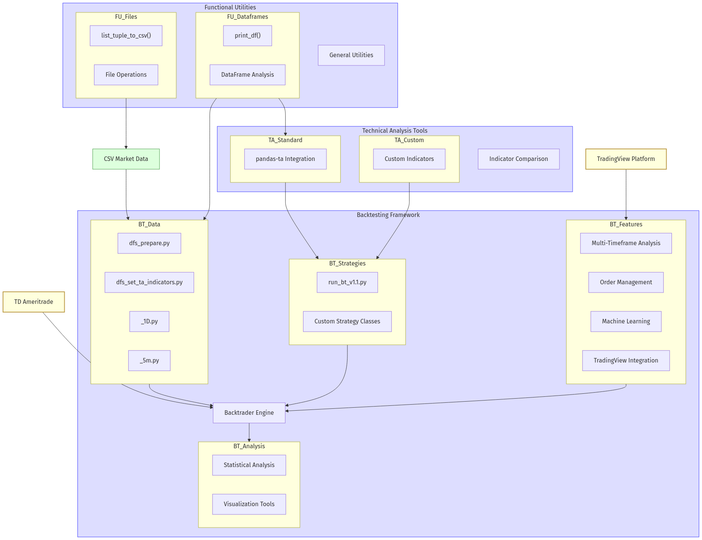

# Bot v3.1 - Algorithmic Trading System

A sophisticated trading bot platform for backtesting trading strategies and executing trades via TD Ameritrade.

## Overview

Bot v3.1 is an advanced algorithmic trading system that enables:

- Backtesting trading strategies against historical market data
- Technical analysis using various indicators and methodologies
- Visualization of trading performance and market data
- Execution of trades through TD Ameritrade's platform

This project is the successor to pc2, offering enhanced functionality, improved architecture, and expanded support for technical indicators and multi-timeframe analysis.

## Project Structure

- **backtesting/**: Core backtesting framework built on Backtrader
  - **backtrader/**: Implementation of strategies, tests, and data preparation
  - **csv_input/**: Historical price data for multiple securities
- **functional/**: Utility modules for data manipulation and file operations
- **ta/**: Technical analysis modules and indicator comparison tools
- **scripts/**: Operational and testing scripts
- **diagrams/**: Architecture diagrams, component diagrams, and supporting documentation for understanding the system's design.

## System Architecture

The system architecture section provides visual representations of the project's design, illustrating how the components interact and function together. These diagrams help users and developers understand the overall structure and relationships within the system.

### High-Level Architecture

The system is designed with modular components to ensure scalability and maintainability. The high-level architecture includes modules for backtesting, technical analysis, data visualization, and trade execution, all interacting seamlessly to provide a robust trading platform.



### Component Diagram

The component diagram provides an in-depth view of the internal structure, detailing how the modules like backtesting, data preparation, and visualization interconnect to support the trading system's functionality.



For more detailed information about the architecture diagrams, refer to the [diagrams documentation](diagrams/README.md).

## Installation

1. Clone this repository:
```bash
git clone [repository-url]
cd bot_v3.1
```

2. Install required packages:
```bash
pip install -r requirements.txt
```

## Usage

### Recording Market Data

To start recording market quotes:

```bash
# On Windows:
cd c:\Users\dbm58\bot_v3.1
# If your directory path contains spaces, use quotes:
cd "c:\Users\dbm58\My Folder\bot_v3.1"

> **Note:** Replace `c:\Users\dbm58\bot_v3.1` with the actual installation path in your environment, and wrap the path in quotes if it contains spaces (e.g., `"c:\Users\dbm58\My Folder\bot_v3.1"`).
python ./scripts/run_record_quotes.py

> **Note:** The provided Windows path is an example. Please adjust it to match your own installation directory.

# On macOS/Linux:
cd /home/username/bot_v3.1
python ./scripts/run_record_quotes.py
```

### Backtesting Strategies

The system provides multiple backtesting methods:

1. **Run a basic backtest:**
```bash
# On Windows (replace 'c:\Users\dbm58\bot_v3.1' with your own installation path):
cd c:\Users\dbm58\bot_v3.1
python backtesting\backtrader\run_bt_v1.1.py

# On macOS/Linux (replace '/home/username/bot_v3.1' with your own installation path):
cd /home/username/bot_v3.1
python backtesting/backtrader/run_bt_v1.1.py
```

2. **Prepare data with indicators:**
```bash
python backtesting\backtrader\dfs_prepare.py
python backtesting\backtrader\dfs_set_ta_indicators_5m.py
```

3. **Visualize backtest results:**
```bash
python backtesting\backtrader\dfs_plot2_positions.py
```

## Key Features

- **Multiple Strategy Support**: Test various trading strategies in isolation or combination
- **Technical Indicators**: Comprehensive set of technical indicators through pandas-ta
- **Visualization Tools**: Plot candles, positions, drawdowns, and performance metrics
- **Statistical Analysis**: Evaluate normal distribution, profit factors, and risk metrics
- **Multi-timeframe Analysis**: Test across different timeframes (1d, 5m, etc.)

## Documentation

Additional documentation is available in the README files within each subdirectory:

- [Backtesting Documentation](backtesting/README.md)
- [Technical Analysis Documentation](ta/README.md)

## Requirements

See [requirements.txt](requirements.txt) for the complete list of dependencies.

## License

This project is licensed under the MIT License. See the [LICENSE](LICENSE) file for details.
