# Bot v3.1 Architecture Diagram

```mermaid
graph TD
    %% Main System Components
    User([User]) --> |interacts| Main[Bot v3.1 System]
    
    %% Core Components
    Main --> Backtesting[Backtesting Framework]
    Main --> TA[Technical Analysis Tools]
    Main --> Functional[Functional Utilities]
    Main --> Scripts[Operational Scripts]
    
    %% Backtesting Subcomponents
    Backtesting --> |strategies| BT_Strategies[Trading Strategies]
    Backtesting --> |data preparation| BT_DataPrep[Data Preparation]
    Backtesting --> |analysis| BT_Stats[Statistical Analysis]
    Backtesting --> |visualization| BT_Viz[Visualization Tools]
    Backtesting --> |framework| BT_Engine[Backtrader Engine]
    Backtesting --> |timeframes| BT_MTA[Multi-Timeframe Analysis]
    Backtesting --> |orders| BT_Orders[Order Management]
    Backtesting --> |external integration| BT_TV[TradingView Integration]
    Backtesting --> |machine learning| BT_ML[Machine Learning Integration]
    
    %% Technical Analysis Subcomponents
    TA --> |standard| TA_Standard[Standard Indicators]
    TA --> |custom| TA_Custom[Custom Indicators]
    TA --> |comparison| TA_Compare[Indicator Comparison]
    TA --> |formatting| TA_Format[Data Formatting]
    
    %% Functional Utilities Subcomponents
    Functional --> FU_Dataframes[DataFrame Operations]
    Functional --> FU_Files[File Operations]
    Functional --> FU_Util[General Utilities]
    
    %% Scripts Subcomponents
    Scripts --> |recording| SC_Record[Market Quote Recording]
    Scripts --> |execution| SC_Execution[Trade Execution]
    Scripts --> |testing| SC_Testing[Testing Scripts]
    SC_Testing --> SC_Plot[Plot Testing]
    SC_Testing --> SC_Polygon[Polygon Integration]
    
    %% External Integrations
    BT_TV --> |signals| TradingView[TradingView Platform]
    SC_Execution --> |trading| Broker[TD Ameritrade]
    SC_Record --> |data| Broker
    SC_Polygon --> |market data| PolygonIO[Polygon.io API]
    
    %% Data Flow
    BT_DataPrep --> |inputs| CSV_Data[CSV Market Data]
    BT_Engine --> |uses| BT_Strategies
    BT_Engine --> |processes| CSV_Data
    BT_Engine --> |generates| Results[Backtest Results]
    Results --> |analyze| BT_Stats
    Results --> |visualize| BT_Viz
    TA_Standard --> |enhances| BT_Strategies
    TA_Custom --> |enhances| BT_Strategies
    FU_Dataframes --> |supports| TA
    FU_Dataframes --> |supports| Backtesting
    FU_Files --> |manages| CSV_Data
    BT_ML --> |enhances| BT_Strategies
    
    %% Styling
    classDef main fill:#f9f,stroke:#333,stroke-width:4px
    classDef core fill:#bbf,stroke:#33f,stroke-width:2px
    classDef subcomponent fill:#ddf,stroke:#33f,stroke-width:1px
    classDef external fill:#ffd,stroke:#b94,stroke-width:2px
    classDef data fill:#dfd,stroke:#494,stroke-width:1px
    
    class Main main
    class Backtesting,TA,Functional,Scripts core
    class BT_Strategies,BT_DataPrep,BT_Stats,BT_Viz,BT_Engine,BT_MTA,BT_Orders,BT_TV,BT_ML subcomponent
    class TA_Standard,TA_Custom,TA_Compare,TA_Format subcomponent
    class FU_Dataframes,FU_Files,FU_Util subcomponent
    class SC_Record,SC_Execution,SC_Testing,SC_Plot,SC_Polygon subcomponent
    class TradingView,Broker,PolygonIO external
    class CSV_Data,Results data
```

## Component Overview

### Core Components

1. **Backtesting Framework**: The central component for testing trading strategies on historical data
   - Trading Strategies: Implementation of various trading algorithms
   - Data Preparation: Tools to process and prepare market data
   - Statistical Analysis: Tools to evaluate strategy performance
   - Visualization Tools: Components to display results graphically
   - Backtrader Engine: The core backtesting implementation
   - Multi-Timeframe Analysis: Tools for combining different timeframes
   - Order Management: Systems for order execution and position sizing
   - TradingView Integration: Connection to TradingView platform
   - Machine Learning Integration: ML models to enhance strategies

2. **Technical Analysis Tools**: Components for market data analysis
   - Standard Indicators: Implementation of common technical indicators
   - Custom Indicators: User-developed specialized indicators
   - Indicator Comparison: Tools to compare indicator effectiveness
   - Data Formatting: Utilities to format data for backtesting

3. **Functional Utilities**: Support functions for the entire system
   - DataFrame Operations: Tools for manipulating pandas DataFrames
   - File Operations: Utilities for file management
   - General Utilities: Miscellaneous helper functions

4. **Operational Scripts**: Scripts for day-to-day operations
   - Market Quote Recording: Tools to record live market data
   - Trade Execution: Scripts to execute actual trades
   - Testing Scripts: Various test utilities
     - Plot Testing: Tools to test visualization components
     - Polygon Integration: Tools to work with Polygon.io API

### External Integrations

- **TradingView Platform**: For chart visualization and strategy prototyping
- **TD Ameritrade**: Broker for trade execution and market data
- **Polygon.io API**: Additional source of market data

### Data Flows

The diagram shows how data flows through the system:
1. Historical data is loaded from CSV files
2. Data is processed and enhanced with technical indicators
3. Trading strategies are applied to the data using the Backtrader engine
4. Results are analyzed statistically and visualized
5. External integrations provide additional data and execution capabilities

## Workflow Example

A typical workflow might involve:
1. Recording market data using Operational Scripts
2. Preparing data with Data Preparation tools
3. Developing strategies using Technical Analysis and Machine Learning
4. Backtesting strategies on historical data
5. Analyzing results with Statistical Analysis and Visualization Tools
6. Refining strategies based on the analysis
7. Executing trades via TD Ameritrade integration