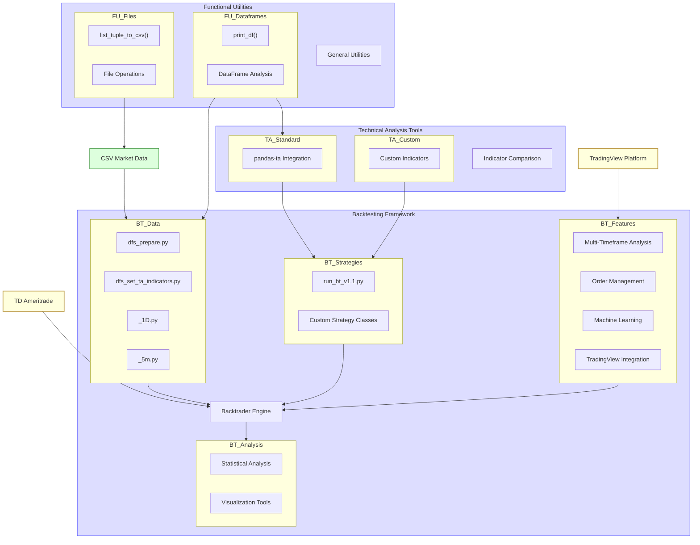

# Bot v3.1 Simplified Component Diagram

## Component Description

This simplified component diagram shows the main parts of the Bot v3.1 system:

### 1. Backtesting Framework
- **Backtrader Engine**: Core backtesting implementation
- **Data Processing**: Prepares market data for analysis
  - dfs_prepare.py: Initial data loading
  - dfs_set_ta_indicators.py: Adds technical indicators
  - Timeframe-specific versions (1D and 5m)
- **Trading Strategies**: Strategy implementation and execution
  - run_bt_v1.1.py: Main execution script
  - Custom strategy classes
- **Analysis & Visualization**: Performance evaluation tools
  - Statistical Analysis: Metrics and distribution tests
  - Visualization Tools: Charts and performance visuals
- **Advanced Features**: Enhanced capabilities
  - Multi-Timeframe Analysis: Combining timeframes
  - Order Management: Position sizing and execution
  - Machine Learning: ML model integration
  - TradingView Integration: External platform connection

### 2. Technical Analysis Tools
- **Standard Indicators**: Common technical indicators via pandas-ta
- **Custom Indicators**: User-developed specialized indicators
- **Indicator Comparison**: Tools to evaluate indicator effectiveness

### 3. Functional Utilities
- **DataFrame Operations**: Tools for data manipulation
- **File Operations**: File handling and CSV management
- **General Utilities**: Miscellaneous helper functions

### 4. External Components
- **CSV Market Data**: Historical price data
- **TradingView Platform**: External visualization and prototyping
- **TD Ameritrade**: Broker for market data and execution

The arrows show the flow of data and dependencies between components.